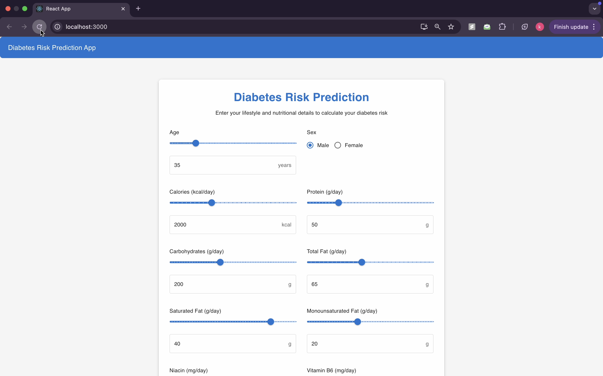
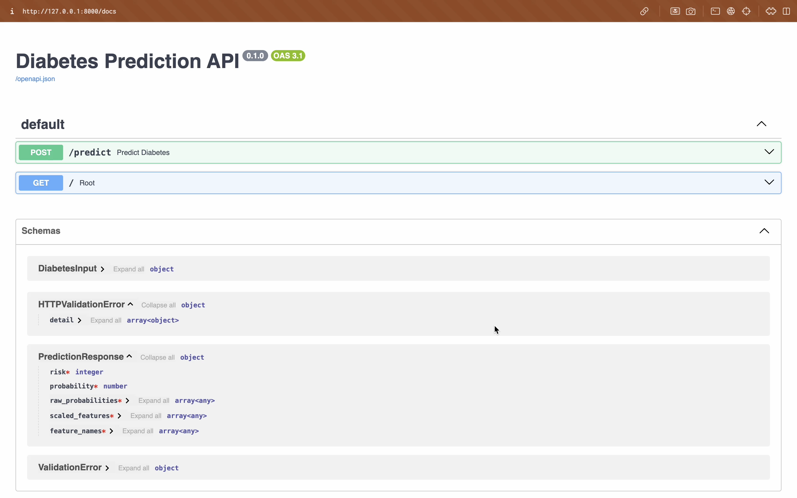
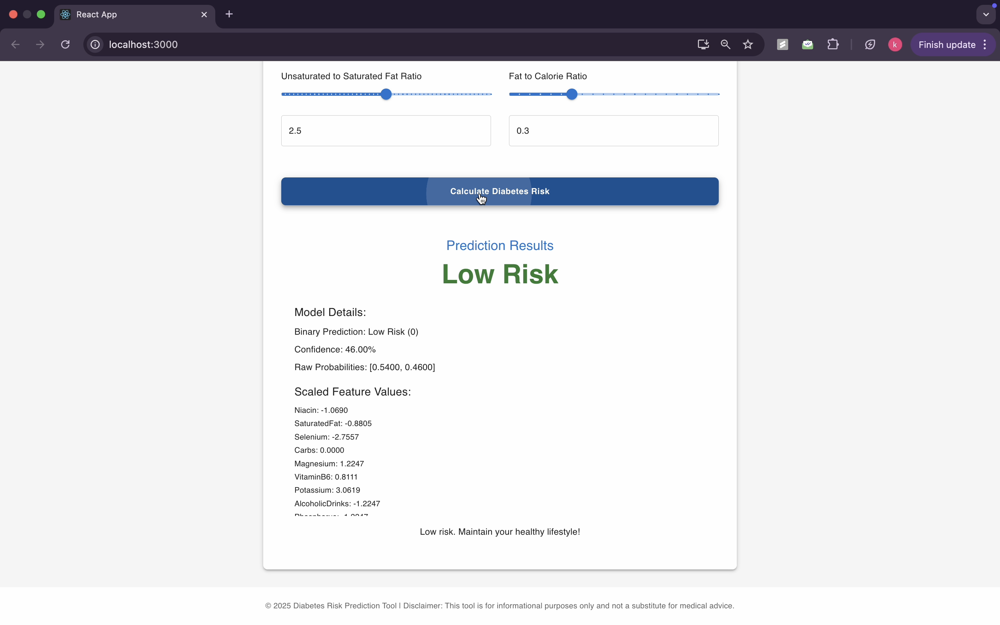
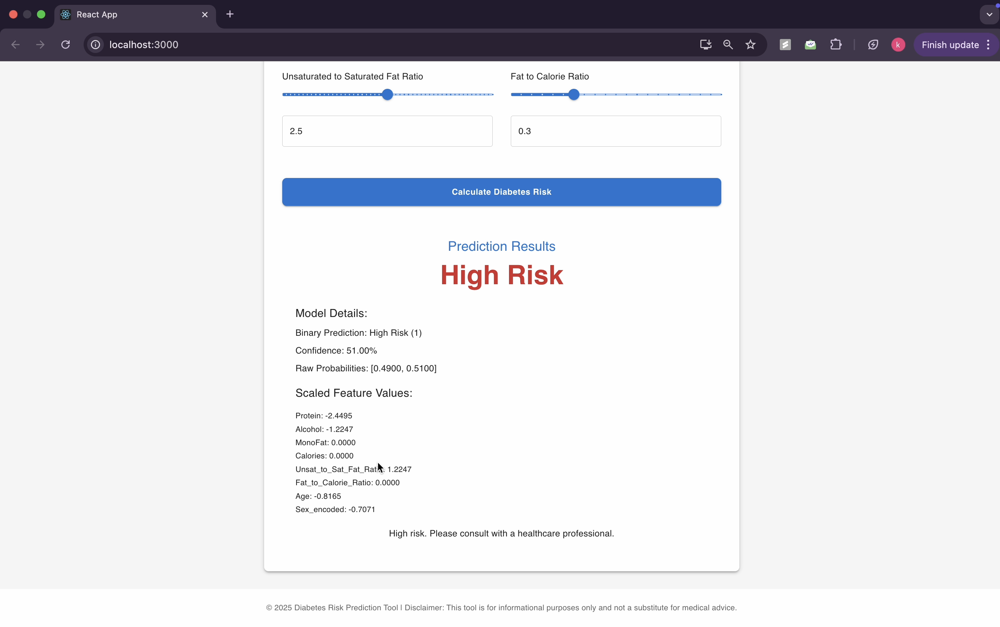

# Diabetes Risk Prediction System

A full-stack web application that predicts the risk of diabetes based on various health parameters using machine learning.

## Project Overview

This project consists of a React-based frontend and a FastAPI-based backend that work together to provide diabetes risk predictions. The system uses a Random Forest Classifier model trained on health parameters to predict whether a person is at high or low risk of developing diabetes.

## Features

- User-friendly web interface for inputting health parameters
- Real-time diabetes risk prediction
- Detailed risk assessment with visual feedback
- Secure and scalable backend API

## Model Details

The prediction system uses a Random Forest Classifier model that was trained on various health parameters including:

- Age
- BMI (Body Mass Index)
- Blood Pressure
- Glucose Levels
- Insulin Levels
- Skin Thickness
- Diabetes Pedigree Function
- Pregnancies (for female patients)

The model was trained using scikit-learn and achieves high accuracy in predicting diabetes risk.

## Screenshots

### Frontend Interface



### Backend API



### Prediction Results

- Low Risk Prediction
  

- High Risk Prediction
  

## Setup and Installation

### Prerequisites

- Python 3.11 or higher
- Node.js and npm
- Git

### Backend Setup

1. Navigate to the backend directory:

   ```bash
   cd diabetes-prediction-backend
   ```

2. Create a virtual environment:

   ```bash
   python -m venv venv
   source venv/bin/activate  # On Windows: venv\Scripts\activate
   ```

3. Install dependencies:

   ```bash
   pip install -r requirements.txt
   ```

4. Start the backend server:
   ```bash
   uvicorn main:app --reload
   ```

### Frontend Setup

1. Navigate to the frontend directory:

   ```bash
   cd diabetes-prediction-frontend
   ```

2. Install dependencies:

   ```bash
   npm install
   ```

3. Start the development server:
   ```bash
   npm start
   ```

## Usage

1. Open your web browser and navigate to `http://localhost:3000`
2. Fill in the required health parameters in the form
3. Click the "Predict" button to get your diabetes risk assessment
4. View the detailed prediction results and recommendations

## Model Training

The model was trained using Google Colab. You can find the training notebook and dataset at:
[Google Colab Notebook Link](https://colab.research.google.com/drive/1YOUR_NOTEBOOK_ID)

### Exporting the Model from Colab

After training the model, we exported both the trained Random Forest model and the fitted StandardScaler using joblib. Here's the code used for export:

```python
from sklearn.preprocessing import StandardScaler
import joblib

# 1. Fit the scaler on your training data
scaler = StandardScaler().fit(X_train)

# 2. Dump both the trained model and the fitted scaler
joblib.dump(rf_model, 'random_forest_diabetes_model.pkl')
joblib.dump(scaler, 'scaler.pkl')
```

These exported files (`random_forest_diabetes_model.pkl` and `scaler.pkl`) are then used in the backend for making predictions.

## Contributing

Contributions are welcome! Please feel free to submit a Pull Request.

## License

This project is licensed under the MIT License - see the LICENSE file for details.
